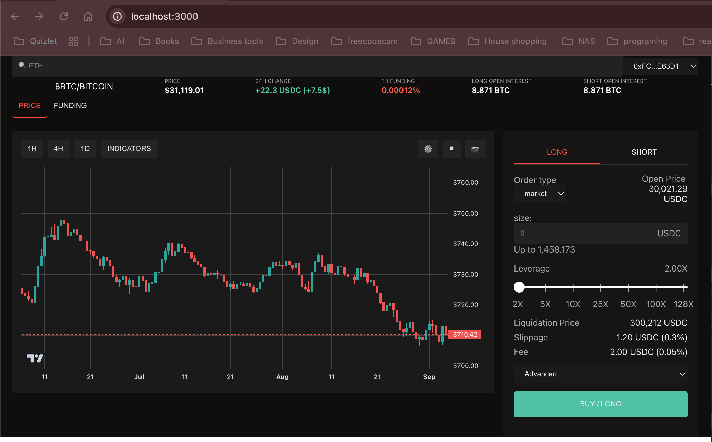

# Getting Started with Create React App

This project was bootstrapped with [Create React App](https://github.com/facebook/create-react-app).

## Available Scripts

In the project directory, you can run:

### `yarn start`

Runs the app in the development mode.\
Open [http://localhost:3000](http://localhost:3000) to view it in the browser.

The page will reload if you make edits.\
You will also see any lint errors in the console.

## Features

- [x] 📈 Interactive Trading Chart using `lightweight-charts`
- [x] 💱 Cryptocurrency price tracking (ETH/BTC)
- [ ] ⚡ Real-time WebSocket updates for live price data
- [ ] 🎯 Multiple timeframe options (1H, 4H, 1D)
- [ ] 💹 Trading indicators support
- [ ] 🔄 Funding rate monitoring
- [x] 📊 Order form for Long/Short positions
- [x] 😀 Social features with emoji reactions on chart

## Technical Stack

- React + TypeScript
- Styled-components for styling
- WebSocket for real-time data
- Lightweight-charts for charting
- RESTful API integration

## Preview

